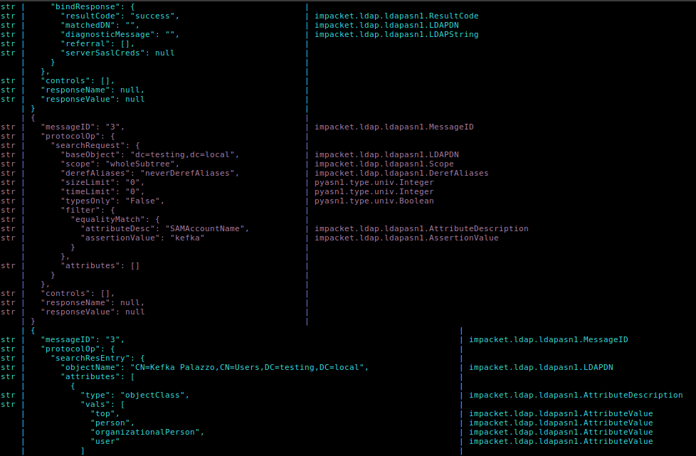

## ``alsanna``
``alsanna`` is a CLI-based intercepting proxy for TCP connections written in Python without third-party dependencies. This was a quick project, thrown together to meet slightly different needs than some existing solutions like [tcpprox](https://github.com/nccgroup/tcpprox). ``alsanna`` lets you monitor TCP connections and modify the TCP stream travelling in either direction before it reaches its destination.

Like its namesake, it is:
* Small, coming in at just over 200 lines of code that can be easily hacked to support whatever quirks your protocol has to
* Composed primarily of dark arts, in this case sockets programming and multiprocessing
* An intermediary between you and the Old Chaos that is the Internet

### Usage

``alsanna`` only supports Python 3, but has no Python dependencies outside the standard library. Arguments are documented with ``argparse``, so you can get a full list by reading the top of the file or by running ``python alsanna.py -h``. I could copy and reformat them here, but I'm not going to.

The editor chosen by default is ``nano``, but you should choose one available on your system. The default configuration expects a certificate and private key, both in ``.pem`` format, at ``./tls_cert.pem`` and ``./tls_key.pem`` respectively. If you already have a TLS-intercepting proxy for HTTPS, an easy way to get these would be to export the certificate and key you're already using and convert them to ``.pem`` format.

Some screenshots:

### Security Considerations
``alsanna`` uses an unspeakably lazy trick for editing TCP messages. Because it just drops them in a temporary file and then opens them in a text editor, this code is almost certainly vulnerable to race conditions. Since the contents of that file are later deserialized into a bytestring, those race conditions can possibly lead to remote code execution if someone can write to the files. And because ``alsanna`` probably has to run as ``root`` to bind well-known ports, that would be pretty bad. Exploitation and mitigation are both left as exercises to the reader.

``alsanna`` does absolutely no certificate verification. This makes testing easier, but it means you should trust your DNS servers and such.

### Future Work
I'd like to add support for generating leaf certificates on the fly. Currently, this only works if the software whose traffic you're intercepting refuses to validate the certificate, or if you generate a certificate with a hostname matching the expected server, which is kind of a hassle.

I'd also like to add support for mTLS. This version only handles impersonating the server.
